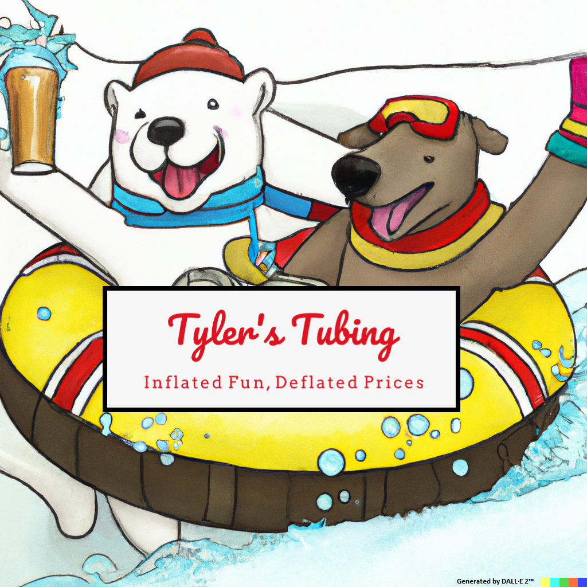

# Take-Home Coding Assessment - 2023 CBG Data Science Summer Internship

## Preface and Reminders

This take-home portion of the interview process is intended to get a sense of your skills in an applied setting and 
understand how you work through problems. The exercise is not meant to take a significant amount of time or dump a 
ton of work on your plate. The business scenario is hypothetical, the data is fully synthetic, and there is not a 
specific correct answer to the problem statement we are looking for. We wanted to give you the opportunity to 
demonstrate your creativity, coding style, and coding habits outside a time-boxed phone interview, and see how you 
make data-driven decisions.

Please do what you can over the next few days, and if you run out of time, document other ideas you had and what else 
you were planning to explore. Defining future work and follow-up questions helps give us further insight into how you 
were approaching the problem. If anything within the business scenario or problem statement seems ambiguous, please use 
that as an opportunity to take creative liberty and flex your ability to deliver solutions in the face of ambiguity.

Feel free to use whatever programming language and workflow you're comfortable with, and include answers and corroborating 
evidence to the problem statement in some form of documentation. Again, this is ***NOT*** intended to become a huge, overwhelming 
take-home problem...just do your best using the time you have available, focus on style and habits, don't go crazy with super 
complex modeling, and try to have fun showing off your coding strengths!

## Business Scenario

Tyler’s Tubing is an outdoor recreation company that offers equipment rentals for river tubing during the summer months 
and snow tubing during the winter months. These activities are very seasonal and weather dependent, so the business 
only operates during certain times of the year. The overhead costs and day-to-day expenses are relatively low, and this 
small business has been profitable over the past few years. The company currently has rental locations in 10 different 
cities and is interested in expanding to a new city and adding a new location in 2023. There are three candidate locations 
being considered, and management needs help selecting one of the three candidates.

#### Existing and Candidate Locations

| Location ID | Current State |
|-------------|---------------|
| 001         | Existing      |
| 002         | Existing      |
| 003         | Existing      |
| 004         | Existing      |
| 005         | Existing      |
| 006         | Existing      |
| 007         | Existing      |
| 008         | Existing      |
| 009         | Existing      |
| 010         | Existing      |
| 011         | Candidate     |
| 012         | Candidate     |
| 013         | Candidate     |

Historical profit data from individual transactions (customers paying fees to rent equipment) and daily weather data are 
available from January 2019 through October 2022 for each of the 10 existing locations, along with a few basic attributes 
of each location (population of the surrounding city and elevation at the location). Weather data and basic attribute data 
are also available for the three candidate locations being considered, but transactional data does not exist, since these 
candidate locations aren't open for business yet. Profits from transactions can occasionally be negative when the daily 
expenses are larger than the revenue being generated.

There are three different brands of systems used across the 10 existing Tyler's Tubing locations to collect transaction data 
and calculate the amount of profit from each transaction. The data fields stored by each system are the same, but the data 
formatting of the fields and the exported file formats differ depending on the brand of the system. Locations only operate 
during certain times of the year, and are closed on major holidays, so there will be time periods with no profit data.

The process used to collect daily weather information isn’t perfect, so there is a small amount of missing weather data 
scattered throughout the dataset.

## Data Dictionaries

### Profit Data From Transaction Systems

| Field          | Description                                                 |
|----------------|-------------------------------------------------------------|
| location_id    | Unique identifier of the rental location                    |
| date           | Date when the transaction occurred                          |
| transaction_id | Unique identifier of the transaction                        |
| profit         | Amount of profit generated from the transaction in dollars  |

### Weather Data Collected Daily

| Field         | Description                                                                           |
|---------------|---------------------------------------------------------------------------------------|
| location_id   | Unique identifier of the rental location                                              |
| date          | Date when the weather measurements were collected                                     |
| temperature   | Average temperature during business operating hours in degrees Fahrenheit             |
| pressure      | Average atmospheric pressure during business operating hours in millibars             |
| humidity      | Average relative humidity during business operating hours, expressed as a percentage  |
| cloudy        | Boolean indicating if it was cloudy during operating hours                            |
| precipitation | Boolean indicating if there was precipitation during operating hours                  |

### Location City Population and Elevation

| Field         | Description                                                  |
|---------------|--------------------------------------------------------------|
| location_id   | Unique identifier of the rental location                     |
| population    | Population of the city where the rental location is located  |
| elevation     | Approximate elevation at the location in meters              |

### Dates of Major Holidays

| Field     | Description                              |
|-----------|------------------------------------------|
| date      | Date of the major holiday                |
| holiday   | Boolean indicating the date as a holiday |

## Problem Statement

Upper management at Tyler's Tubing wants you to project the profitability of each of the three candidate locations 
(Location ID '011', '012', and '013'), and based on these projections, help determine which one of the three candidate 
locations should be opened in 2023. Attempting to predict weather patterns in 2023 is unreasonable, so management 
would like you to predict what profits ***MIGHT*** have been at each of the three candidate locations ***IF*** the locations 
had been open and operating during appropriate time periods from January 1st through October 30th of 2022. Based on these 
predictions, which location would have likely been the most profitable in the first 10 months of 2022 if it had been open 
for business?
